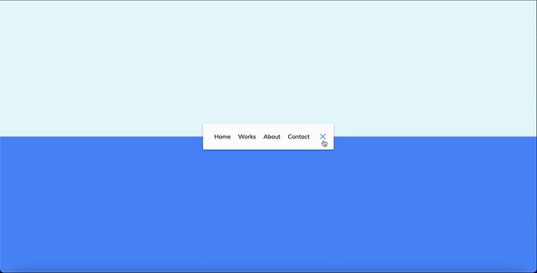

# Animated_Navigation
A responsive and animated navigation menu built with HTML, CSS, and JavaScript.

## Preview

## Features

- Smooth and interactive navigation menu.
- Responsive design that adapts to different screen sizes.
- Animations for menu items and hamburger icon.
- Easy customization of colors and styles.

## Technologies Used

- HTML
- CSS
- JavaScript

## Usage

1. Clone the repository: `git clone https://github.com/Lincoln2303/Animated_Navigation.git`
3. Follow the HTML structure and CSS classes as provided in the example.
4. Customize the colors and styles in the CSS file to match your project's design.
5. Add event listeners and functionality to handle navigation actions in the JavaScript file.

## License

This project is licensed under the [MIT License](LICENSE).

## Acknowledgements

The project is part of the "50 projects in 50 days - HTML, CSS & Javascript" course on Udemy by Brad Traversy.
